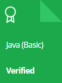
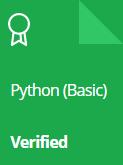
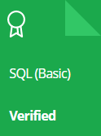
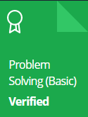

 

<h3 align="center">A passionate of Software Developer from India 🇮🇳</h3>

- 🌱 I’m currently learning  &nbsp;&nbsp;&nbsp;&nbsp;&nbsp;&nbsp;&nbsp;&nbsp;&nbsp;&nbsp;&nbsp;&nbsp;&nbsp;&nbsp;&nbsp;&nbsp;&nbsp;&nbsp;&nbsp;&nbsp;&nbsp;&nbsp;**1. Data Structure and Algorithms** &nbsp;&nbsp;&nbsp;&nbsp;&nbsp;&nbsp;&nbsp;&nbsp;&nbsp;&nbsp;&nbsp;&nbsp;&nbsp;&nbsp;&nbsp;&nbsp;&nbsp;&nbsp;&nbsp;&nbsp;&nbsp;
**2. Javascript**  
- 📫 How to reach me **prathameshdhande534@gmail.com**

<h3 align="left">Connect with me:</h3>

&nbsp;             
&nbsp;
&nbsp;
&nbsp;

&nbsp;

<h3 align="left">Languages :</h3>

   &nbsp;
 

<h3 align="left">Tools :</h3>

 &nbsp; <a href="https://www.adobe.com/products/premiere.html" target="_blank" rel="noreferrer"> &nbsp;&nbsp; &nbsp;</a>
&nbsp;

<h3 align="left">Python Libraries :</h3>

  

<h3>HackerRank Verified Skills :</h3>
 &nbsp;
 &nbsp;
 &nbsp;

 

<h3> My Trophies in Github :</h3>

  

<h3> Most Used Languages :</h3>

 

 

